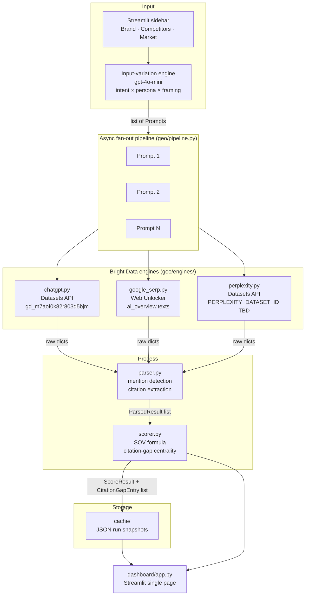

# GEO Command Center

**AI visibility intelligence for marketing teams.** Know whether — and how — your brand shows up when buyers ask generative AI engines for recommendations, then get prioritized, source-grounded actions to close the gaps.

Built for the [Bright Data hackathon](https://brightdata.com) — GTM Intelligence track.


<!-- TODO: add a GitHub repo URL once pushed and replace the badge links above with dynamic shields.io endpoints -->

---

## The problem

Buyers increasingly ask ChatGPT or Perplexity "what's the best CRM for a small team?" instead of searching Google. Marketing teams have near-zero tooling to answer: *Are we mentioned? Who is recommended instead? What sources are the AI engines citing when they recommend competitors? Does any of this hold across different buyer types or phrasings?*

Auditing this manually means querying several engines, several ways, noting the answers, finding the URLs — slow, unrepeatable, and one person's perspective.

---

## What it does

One run fans out a curated set of varied inputs — multiple **buyer intents, personas, and phrasings** — across AI engines in parallel, then surfaces:

| Output | What you get |
|---|---|
| **Visibility score (0–100)** | Share-of-voice across all responses; broken down by engine, intent, and persona |
| **Per-response mention table** | Which brands appeared, in what position, and whether as a recommendation |
| **Citation-gap list** | Competitor-cited source domains ranked by *centrality* — sources that move the most queries at once |
| **Score transparency** | Every number exposes its formula components so nothing is a black box |

> **Honest scope note:** The knowledge graph layer (Cognee), sentiment-with-source-tracing, and the recommendation engine are designed and specified but not yet wired into this build. See [Roadmap](#roadmap).

---

## Architecture



**Data flow in one sentence:** `RunConfig` → varied `Prompt` list → async fan-out across (prompt, engine) pairs → `ParsedResult` list → `ScoreResult` + `CitationGapEntry` list → Streamlit dashboard.

### Engine status

| Engine | Status | Via |
|---|---|---|
| ChatGPT | **Working** (validated 2026-05-28) | Bright Data Datasets API (`gd_m7aof0k82r803d5bjm`) |
| Google AI Overview | **Working** (validated 2026-05-28) | Bright Data Web Unlocker SERP + `ai_overview.texts` |
| Perplexity | Implemented — **dataset ID needed** | Bright Data Datasets API (add `PERPLEXITY_DATASET_ID` to `.env`) |
| Grok | Not available | Blocked by X as of validation date |

---

## Visibility score — formula

The score is fully transparent. Every component is exposed in the dashboard's "Score components" expander.

```
mention_rate   = responses_mentioning_target / total_responded
position_score = 1 − ((avg_position − 1) / max_position)   [0..1; higher = earlier mention]
visibility_score = (mention_rate × 0.7 + position_score × 0.3) × 100
```

Weights are shown in the `components` dict returned by `scorer.score()`. The formula is explicit by design — no opaque scoring.

---

## Project structure

```text
GEO analyst/
├── geo/                        # Main Python package
│   ├── config.py               # Env loading; API tokens; dataset IDs; poll config
│   ├── models.py               # RunConfig, Prompt, ParsedResult, ScoreResult, CitationGapEntry
│   ├── pipeline.py             # Async fan-out orchestrator; caches results to cache/
│   ├── parser.py               # Mention detection (regex + context window); citation extraction
│   ├── scorer.py               # SOV formula; citation-gap centrality ranking
│   ├── variation.py            # LLM-driven prompt generation (gpt-4o-mini) + semantic dedup
│   └── engines/
│       ├── base.py             # BaseEngine ABC (query / extract_text / extract_citations)
│       ├── chatgpt.py          # Bright Data Datasets API — async poll pattern
│       ├── google_serp.py      # Bright Data Web Unlocker — ai_overview extraction
│       └── perplexity.py       # Bright Data Datasets API — same pattern; needs dataset ID
├── dashboard/
│   └── app.py                  # Streamlit single-page dashboard
├── scripts/
│   ├── validate_brightdata.py  # One-shot validation script for Bright Data scrapers
│   ├── validate_chatgpt.json   # Captured raw ChatGPT response (verified shape)
│   ├── validate_chatgpt_raw.json
│   └── validate_perplexity.json
├── cache/                      # Auto-created; JSON run snapshots for offline replay
├── data-contract.md            # Internal + external data shapes; external shapes are verified
├── graph-schema.md             # Cognee knowledge graph schema (designed; not yet wired)
├── geo-command-center-prd.md   # Full PRD
├── requirements.txt            # Python dependencies
└── .env                        # API keys (not committed; see Prerequisites)
```

---

## Prerequisites

- Python 3.12 or later
- A [Bright Data](https://brightdata.com) account with:
  - `BRIGHTDATA_API_TOKEN` — required to run live captures
  - `BRIGHTDATA_ZONE` — defaults to `mcp_unlocker`
- `OPENAI_API_KEY` — required for the input-variation engine (`gpt-4o-mini`); without it the dashboard falls back to a fixed 5-prompt set
- `PERPLEXITY_DATASET_ID` — find in your Bright Data dashboard at `/cp/scrapers/gd_xxx`; leave blank if not using Perplexity

---

## Installation

```bash
# Clone the repo
git clone <repo-url>
cd "GEO analyst"

# Create and activate a virtual environment
python -m venv .venv
source .venv/bin/activate   # Windows: .venv\Scripts\activate

# Install dependencies
pip install -r requirements.txt

# Copy the env template and fill in your keys
cp .env.example .env        # or create .env manually (see Prerequisites)
```

> Note: there is no `.env.example` in the repo yet. Create `.env` manually with the keys listed in Prerequisites. <!-- TODO: add .env.example -->

---

## Running the dashboard

```bash
streamlit run dashboard/app.py
```

The dashboard opens at `http://localhost:8501`. From the sidebar:

1. Enter your **target brand**, **competitors** (one per line), and **market/category**.
2. Select which engines to query.
3. Toggle **Input-variation engine** on if you have an `OPENAI_API_KEY` — this generates varied prompts across intent × persona × framing axes and de-duplicates near-paraphrases before sending them to Bright Data.
4. Click **Run Live Analysis** — the pipeline fans out all (prompt, engine) pairs concurrently and streams results into the dashboard.
5. Alternatively, **load a cached run** from the sidebar to replay offline without consuming Bright Data quota.

> **Budget note:** each (prompt × engine) is one Bright Data request. A 10-prompt × 2-engine run = 20 requests against your 5,000/month free tier.

---

## Validating Bright Data integrations

Before a live run or after changing API credentials:

```bash
python scripts/validate_brightdata.py
```

This makes one real call per configured scraper, prints the HTTP status and first 2 KB of the response, and saves the full raw JSON to `scripts/validate_<engine>.json`. Use those files to confirm the data shapes before running the full pipeline.

---

## Key design decisions

**Input variation is breadth of perspective, not temporal drift.** A varied-input run answers "how visible am I across the different ways buyers ask, right now." Temporal drift — how visibility changes over time — requires runs separated by real elapsed time. These are explicitly kept separate in code and in the dashboard output.

**Graceful degradation.** If an engine call fails, `responded=False` is set on that `ParsedResult` and the run continues. The dashboard shows failed/skipped counts and the errors are surfaced in an expander.

**All ranking is explicit.** Centrality score = `competitor_count × engine_count` (with intent dimension to be added when Cognee is wired). The components dict exposes the inputs to the score formula. There is no opaque ranking.

**Cache-first development.** Every run is written to `cache/<run_id>.json`. Load cached runs from the sidebar to iterate on the dashboard without consuming API quota.

---

## Roadmap

These items are designed and specified in the PRD and data contracts but not yet built:

- **Cognee knowledge graph layer** — write brands, sources, prompts, engines, and sentiment associations to a persistent graph; query for centrality, consideration-set, and sentiment-to-source traces across a full varied-input run
- **Consideration-set mapping** — surface which competitors engines group together and whether the target brand is inside or outside the dominant cluster
- **Sentiment with source tracing** — extract positive/negative associations per brand and link each back to the citing source
- **Recommendation engine** — per-gap recommendations grounded in graph centrality; at least one draft artifact (blog outline or short post structured for AI extractability)
- **FastAPI backend** — wrap the pipeline as a proper REST service; currently the pipeline is invoked directly from the Streamlit app
- **Perplexity dataset ID** — validate the Perplexity scraper dataset ID in Bright Data and set `PERPLEXITY_DATASET_ID` in `.env`
- **Temporal drift queries** — cross-run comparisons over real elapsed time (architecturally supported via run timestamps; not demoable in a single sitting)
- **Google AI Overview stretch goal** — the `google_serp` engine is already built and validated; this item is about surfacing it as a first-class fourth engine in the dashboard once the three-engine core is solid

---

## Stack

| Layer | Technology |
|---|---|
| Backend | Python 3.12, asyncio, aiohttp |
| Dashboard | Streamlit |
| AI engine access | Bright Data (Datasets API + Web Unlocker) |
| Input variation | OpenAI `gpt-4o-mini` via `openai` SDK |
| Data shapes | Pydantic v2 + Python dataclasses |
| LLM inference (planned) | Anthropic API / AI/ML API |

---

## License

<!-- TODO: no LICENSE file is present in the repo. Add one and update this section. -->
License not yet specified.
